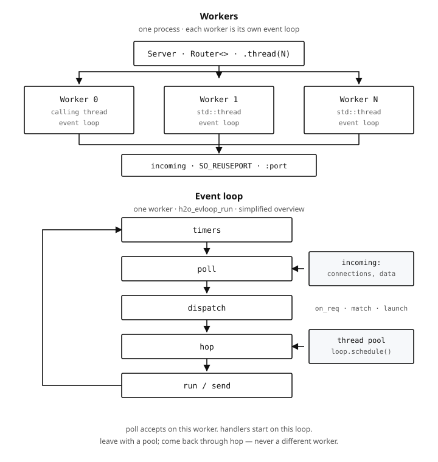

<div align="center">

# owl

**Header-only C++23 web framework on libh2o**

Typed handler parameters, a compile-time-validated route trie, and
coroutine handlers that never leave the event loop.

[](https://en.cppreference.com/w/cpp/23)
[](#)
[](#)

[Handlers](#handlers) · [Responses](#responses) · [Extractors](#extractors) · [State](#state) · [Middleware](#middleware) · [Server](#server) · [Layout](#layout) · [Roadmap](#roadmap)

</div>

> [!WARNING]
> Part of [owl](../README.md). Experimental. Not production-ready.

```cpp
#include <owl/owl.h>

owl::Response ping(owl::RequestView) {
    return owl::Response::ok("pong");
}

owl::Response hello(owl::RequestView, owl::PathView<"name"> name) {
    return owl::Response::ok(std::format("hello {}", name.value));
}

struct App final {};

auto router = owl::Router<App>::make()
              .route<"/ping">(owl::get(ping))
              .route<"/hello/{name}">(owl::get(hello));
```

Link `owl::owl`. Pulls `libh2o-evloop`, `owl::coro`, `owl::fstr`, nlohmann_json, OpenSSL, and zlib.

## Handlers

A handler is any free function returning `owl::Response`, or `coro::task` of one. Its parameters are extracted from the request; the route pattern is checked against them at compile time, so asking for a path parameter the pattern does not declare is a build error, not a 404.

```cpp
coro::task<owl::Response> calc(const owl::loop_scheduler& loop, owl::Path<"n", int> n) {
    co_await loop.schedule();
    co_return owl::Response::ok(std::format("{}", n.value * 2));
}
```

## Responses

`Response` is untyped so middleware can `co_await next()` and return the same object. Factories fix status and body together: `ok`, `json`, `body`, `stream`, `sse`, `error`, `no_content`, `redirect`. Headers chain on afterwards.

```cpp
owl::Response login(owl::RequestView) {
    return owl::Response::ok("ok")
           .header("x-trace", trace_id)
           .set_cookie({.name = "sid", .value = token, .http_only = true});
}
```

`set_cookie` appends instead of replacing, because `Set-Cookie` is the one response header that legitimately repeats. `sse()` frames each chunk as `data: …\n\n` and sets `cache-control: no-cache`. It does not send `Connection` — that header is hop-by-hop and belongs to h2o.

## Extractors

| Parameter                            | Source                  | Missing / malformed |
|--------------------------------------|-------------------------|---------------------|
| `RequestView`                        | the request itself      | —                   |
| `PathView<"n">` / `Path<"n", T>`     | path segment            | 404                 |
| `QueryView<"q">` / `Query<"q", T>`   | query string            | 400                 |
| `HeaderView<"h">` / `Header<"h", T>` | header                  | 400                 |
| `BodyView`                           | raw body                | —                   |
| `Json<T>`                            | JSON body               | 415 / 400 / 422     |
| `State<T>`                           | router state            | 500                 |
| `loop_scheduler`                     | the worker's event loop, bound with no copy when taken as `const&` | 500                 |
| `const sql::pool<sql::psql>&`        | the worker's postgres pool (`-DOWL_ENABLE_POSTGRESQL=ON`) | 500                 |
| `const sql::pool<sql::sqlite>&`      | the worker's sqlite pool (on by default)                  | 500                 |
| `const redis::client&`               | the worker's Redis client (`-DOWL_ENABLE_REDIS=ON`)         | 500                 |

A custom extractor is one `FromContext` specialization — the built-ins in `extract/from_context.h` are the same protocol, and make good reference. The parameter type is the value the handler receives; the specialization answers either that value or a `KickToken`, which carries any status, so `401` needs no special support:

```cpp
struct Bearer {
    std::string_view token;
};

template <>
struct owl::FromContext<Bearer> {
        template <typename S>
        std::expected<Bearer, owl::KickToken> operator()(const owl::Context<S>&, const owl::Request& req) const {
        const auto auth = req.header("authorization");  // header names match case-insensitively
        if (!auth || !auth->starts_with("Bearer ")) {
            return std::unexpected(owl::KickToken{"missing bearer token", 401});
        }
        return Bearer{auth->substr(7)};
    }
};

owl::Response whoami(Bearer token) {
    return owl::Response::ok(std::string{token.token});
}

struct App final {};

auto router = owl::Router<App>::make()
              .route<"/whoami">(owl::get(whoami));
```

The `std::unexpected` wrap is mandatory — `std::expected` converts from `std::unexpected<KickToken>`, never from a bare error. The token is a view into the request's header table, which outlives the handler, so no copy is needed. Declare the specialization in a header of yours next to the type and include it before the route that uses it: the handler's parameters are checked where the route is declared, so a specialization that is not visible yet is a build error, not a runtime surprise.

## State

State is bound once, at the end:

```cpp
struct AppState { int hits = 0; };

owl::Response hits(owl::State<AppState> app) {
    return owl::Response::json(std::format(R"({{"hits":{}}})", ++app->hits));
}

auto v1 = owl::Router<AppState>::make()
          .route<"/hits">(owl::get(hits));

auto router = owl::Router<AppState>::make()
              .nest<"/api/v1">(std::move(v1))
              .route<"/hits">(owl::get(hits));

owl::Server<AppState>::builder()
    .router(std::move(router))
    .config({.port = 8080})
    .build_with(std::make_shared<AppState>());
```

State is bound on `Server<AppState>` via `build_with`, so a server that never got its state fails to compile rather than at startup. `Router<S>` and `Server<S>` share `S`; a handler naming `State<T>` for any other `T` is a compile error. `nest` only accepts the same `S`.

## Middleware

A middleware coroutine takes `const Request&` and `Next<S>`, optionally `const Context<S>&` when it needs state, and returns `task<Response>`. Call `next` to continue; return a response to kick. Headers apply on the way out.

```cpp
coro::task<owl::Response> timing(const owl::Request& req, owl::Next<AppState> next) {
    const auto start = std::chrono::steady_clock::now();
    owl::Response res = co_await next(req);
    res.header("x-elapsed-ms", std::to_string(
        std::chrono::duration_cast<std::chrono::milliseconds>(
            std::chrono::steady_clock::now() - start).count()));
    co_return std::move(res);
}

auto router = owl::Router<AppState>::make()
              .layer(timing)
              .route<"/ping">(owl::get(ping));
```

`Server::Builder::layer` is the outermost chain (MatchedChains slot 0). Nested `Router::layer` runs only under that prefix.

## Prometheus

See [`prometheus/README.md`](../prometheus/README.md). Build with `-DOWL_ENABLE_PROMETHEUS=ON`: `owl::owl` then depends on `owl::prometheus` (which itself pulls nothing), and the server records HTTP RED itself — every exchange through dispatch under its route pattern, thrown handlers as `500`, and unmatched requests (`404`/`405`, dispatch failures) counted without a duration. Your handler only serves `owl::prometheus::dump()` as `text/plain; version=0.0.4; charset=utf-8`.

## SQL

See [`sql/README.md`](../sql/README.md). With a driver enabled (SQLite is, by default; Postgres with `-DOWL_ENABLE_POSTGRESQL=ON`), `owl::owl` pulls `owl::sql`, the builder gains `with_psql(sql::psql::config)` and `with_sqlite(sql::sqlite::config)`, and every worker gets its own pools on its own loop. A handler takes the pool by `const&` and awaits `sql::query<"...">(pool, args...)`; the wait never leaves the worker.

See [`redis/README.md`](../redis/README.md). With `-DOWL_ENABLE_REDIS=ON`, `owl::owl` pulls `owl::redis`, the builder gains `with_redis(redis::config)`, and every worker gets its own client on its own loop. A handler takes it by `const&` and awaits `redis::command(rd, "GET", key)` or one of the typed helpers; a subscription is `redis::subscribe(rd, {channel})`, ended by scope or a `std::stop_token`.

## Server

```cpp
owl::Server<AppState> server = owl::Server<AppState>::builder()
                     .router(std::move(router))
                     .config({.port = 8080})
                     .thread(4)
                     .build_with(std::make_shared<AppState>());
server.start();
```

`router` is a `Router<S>`. `.thread(N)` starts N workers — Node cluster, in-process. Worker 0 runs on the calling thread; the rest are extra threads. Each worker is a single-threaded event loop with its own `SO_REUSEPORT` listener. They share the router.

Do not block the loop. Offload with a pool; `co_await loop.schedule()` or `loop.post(handle)` hops back (Node's `setImmediate` from another thread). Resume is always on the **same** worker.

Each box below is one turn of that worker's `h2o_evloop_run`:

<p align="center">
  
</p>

## Layout

`include/owl/` is layered bottom-up — nothing lower includes anything higher:

| Directory  | Holds                                                                                       |
|------------|---------------------------------------------------------------------------------------------|
| `core/`    | vocabulary types with no local dependencies: `Method`, `State`, `Context`, `KickToken`, pool allocator |
| `util/`    | `pool_map`, string helpers                                                                  |
| `http/`    | `Request`, `Response`, cookies, reason phrases; `detail/` for send/finish                   |
| `extract/` | parsing, extractor types, and the `FromContext` dispatch                                    |
| `routing/` | the route trie, `Router`, middleware                                                        |
| `coro/`    | `loop_scheduler`, which hops work back onto the request's event loop                        |
| `server.h` | h2o workers, listeners, and the dispatch entry point                                        |

`owl.h` includes all of it.

## Roadmap

Not started. Each item should sit on `coro` + the event loop the way handlers already do — no extra thread pools, no blocking the worker.

|                       | Sketch                                                                                |
|-----------------------|---------------------------------------------------------------------------------------|
| **WebSocket**         | ---                                                                                   |
| **Redis**             | RESP client on `coro::native_reactor`. Extractor or `State<>` for a shared pool.      |
| **Static files**      | Route that sendfiles a directory. Range requests later.                               |
| **TLS**               | HTTPS as a `Server::Builder` switch; h2o already links OpenSSL.                       |
| **Graceful shutdown** | Stop listeners, drain in-flight handlers, then join workers.                          |
